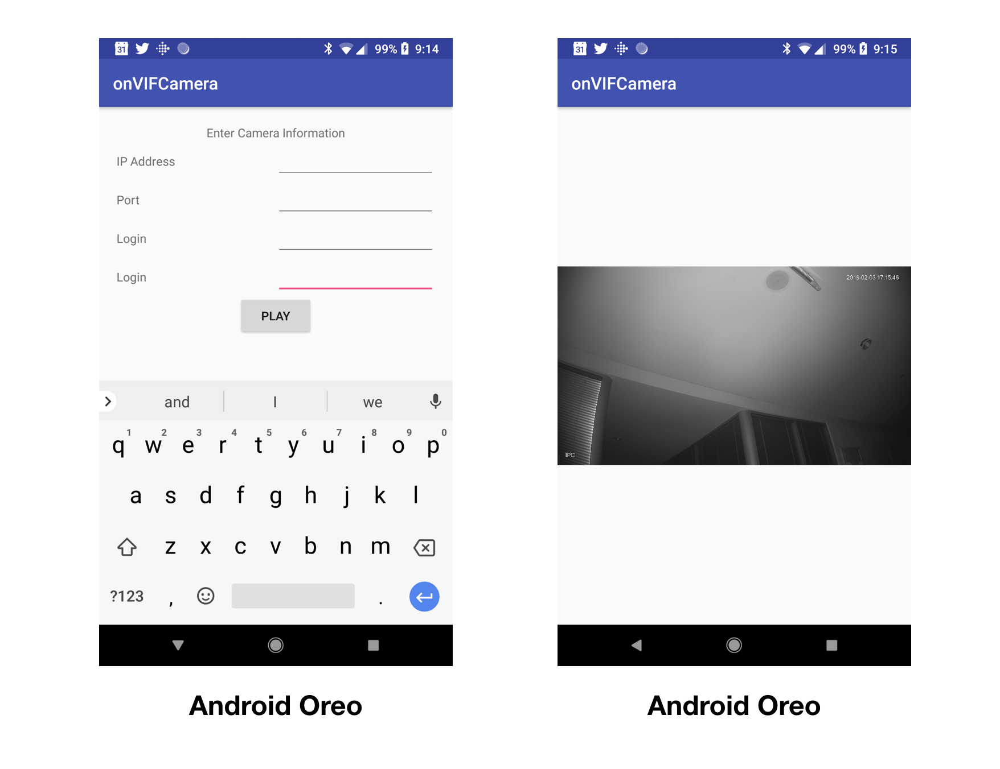

# onVIFCamera-Anroid

This library have been developped to ease the connection of an Android device to an ONVIF Camera.
With this library you are able to get the informations from a camera, the different media profiles available and retrieve the stream URI to play it.

## Example

To run the example project, clone the repo, and compile in Android Studio

## Requirements
Hardware: Android phone that runs KitKat (4.4) or newer
Software: Android Studio

To use this project on an Android device (real device, not a simulator), with android min SDK at 19, Android 4.4 KitKat

In gradle, it is important that we use  compile 'com.github.potterhsu:RtspLibrary:v1.0'

## Author

Peter Ma, @nyceane

## License

ONVIFCamera is available under the MIT license. See the LICENSE file for more info.
